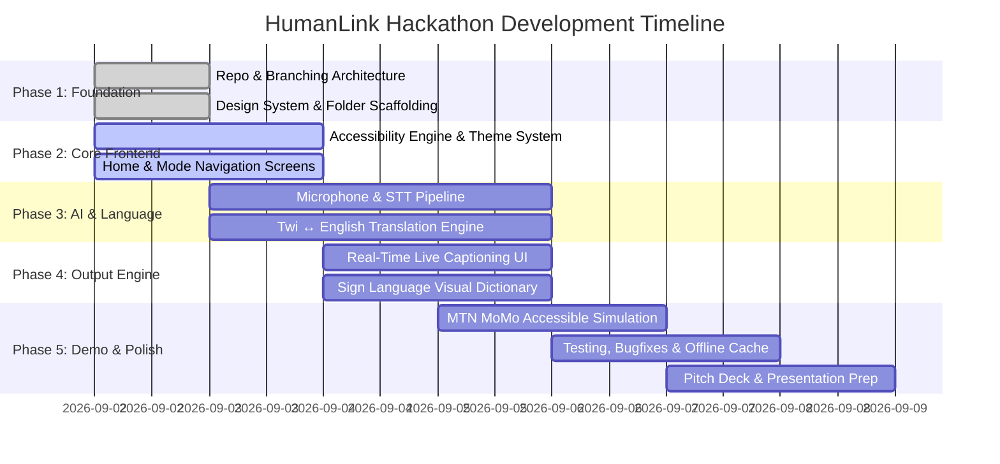

# HumanLink 🚀 — Project Roadmap & Team Task Allocations

**Hackathon:** MTN Ghana Tɛkyerɛma Pa Hackathon 2026  
**Project Lead:** Redeemer Jerrey Kow Williams  
**Repository:** [https://github.com/HumanLink-Hackathon/HumanLink](https://github.com/HumanLink-Hackathon/HumanLink)

---

## 🗺️ Visual Project Roadmap



---

## 👥 Team Roles & Detailed Task Assignments

### 1. 👑 Redeemer Jerrey Kow Williams (`@soarmedia`)
**Role:** Project & Technical Lead / System Architect  
**Branch Responsibility:** `main`, `develop`, Architecture Reviews

| ID | Task Description | Priority | Deliverable / PR |
| :--- | :--- | :--- | :--- |
| **R-1** | Manage Git workflow, branch protections, and PR reviews | **P0** | Continuous |
| **R-2** | Architect Flutter state management & service locator (`lib/core/`) | **P0** | `feature/core-architecture` |
| **R-3** | Final integration of AI pipeline, UI, and Sign Language engine | **P0** | Integration PR into `develop` |
| **R-4** | Coordinate final hackathon pitch deck & live demo script | **P0** | `docs/DEMO_SCRIPT.md` |

---

### 2. 🎨 Pearl Tulasi Mawufemo
**Role:** UI/UX & Accessibility Specialist  
**Target Feature Branch:** `feature/accessibility-ui`

| ID | Task Description | Priority | Deliverable / PR |
| :--- | :--- | :--- | :--- |
| **P-1** | Review and finalize High-Contrast Theme (Dark, Light, MTN Yellow) | **P0** | `lib/core/theme/` |
| **P-2** | Design accessible visual hierarchy (Large touch targets, font scaling) | **P0** | UI Design Tokens & Guidelines |
| **P-3** | Optimize Live Caption readability (line spacing, contrasting boxes) | **P0** | `lib/features/captions/` UI Review |
| **P-4** | Conduct accessibility & usability testing (WCAG compliance) | **P1** | `docs/accessibility/audit.md` |

---

### 3. 🤖 Enock Kyei-Baffour (`@Courteous05`)
**Role:** Backend & AI Engineer  
**Target Feature Branch:** `feature/ai-translation-engine`

| ID | Task Description | Priority | Deliverable / PR |
| :--- | :--- | :--- | :--- |
| **E-1** | Implement Twi $\leftrightarrow$ English Translation pipeline / API service | **P0** | `lib/ai/translation/` |
| **E-2** | Integrate Speech-to-Text (STT) audio capture & language detector | **P0** | `lib/ai/speech/` |
| **E-3** | Create offline phrase bank cache for guaranteed demo reliability | **P0** | `assets/translations/phrasebank.json` |
| **E-4** | Benchmark and optimize response latency for live transcription | **P1** | `docs/research/latency_benchmark.md` |

---

### 4. 📱 Hannah Aidoo (`@faculty-NA`)
**Role:** Flutter Developer & Ghanaian Language Researcher  
**Target Feature Branch:** `feature/conversation-flow`

| ID | Task Description | Priority | Deliverable / PR |
| :--- | :--- | :--- | :--- |
| **H-1** | Build the Dual-Party Conversation Screen (Listening state, Waveform) | **P0** | `lib/features/conversation/` |
| **H-2** | Research & curate authentic Twi everyday & customer care expressions | **P0** | `docs/research/twi_phrases.md` |
| **H-3** | Implement language switcher and speech input feedback controls | **P0** | `lib/widgets/language_selector.dart` |
| **H-4** | Verify Twi text pronunciation and TTS audio output | **P1** | `lib/services/tts_service.dart` |

---

### 5. 🧪 Able Mwintuma Gambo (`@mwintuma`)
**Role:** Software Developer / Data Models & QA  
**Target Feature Branch:** `feature/sign-language-momo`

| ID | Task Description | Priority | Deliverable / PR |
| :--- | :--- | :--- | :--- |
| **A-1** | Implement Data Models (`Message`, `Conversation`, `SignResource`) | **P0** | `lib/models/` |
| **A-2** | Build Controlled Ghanaian Sign Language visual dictionary & player | **P0** | `lib/features/sign_language/` |
| **A-3** | Build MTN Mobile Money / Customer Service accessibility simulator | **P1** | `lib/features/financial_services/` |
| **A-4** | Write automated unit and widget tests for core flows | **P1** | `test/unit/`, `test/widget_test.dart` |

---

## 📌 Sprint Priorities Breakdown

```text
┌─────────────────────────────────────────────────────────────┐
│ P0 (Critical - Must have for Demo)                          │
├─────────────────────────────────────────────────────────────┤
│ 1. Voice input (STT) in Twi & English                       │
│ 2. Twi ↔ English translation pipeline                       │
│ 3. Large high-contrast live captions                        │
│ 4. Bilingual conversational bridge UI                       │
│ 5. Curated Sign Language visual library (Top 10-15 phrases) │
├─────────────────────────────────────────────────────────────┤
│ P1 (Important - High Impact)                                │
├─────────────────────────────────────────────────────────────┤
│ 1. MTN MoMo accessible customer care demo                   │
│ 2. Dynamic font scaling & contrast toggles                  │
│ 3. Offline backup phrase bank for 100% demo stability       │
├─────────────────────────────────────────────────────────────┤
│ P2 (Nice to Have)                                           │
├─────────────────────────────────────────────────────────────┤
│ 1. Conversation history export                              │
│ 2. Extended Ghanaian languages roadmap (Ga, Ewe, Fante)     │
└─────────────────────────────────────────────────────────────┘
```

---

## 🔄 Daily Collaboration Rhythm

1. **Morning Sync (Async on WhatsApp / GitHub)**:
   - What did you complete yesterday?
   - What are you working on today?
   - Any blockers?
2. **Branching & Committing**:
   - Always branch from `develop`: `git checkout -b feature/<your-task>`
   - Push your branch: `git push -u origin feature/<your-task>`
   - Open PR on GitHub with screenshot/test results.
3. **PR Merging**:
   - Minimum 1 review required before merging into `develop`.
